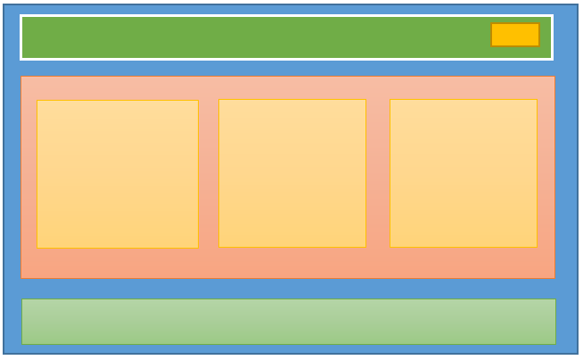

En el post de hoy comparto un escenario en una aplicación Angular 2, un poco de teoría, código y reflexiones. Creo que un ejemplo de la ‘vida real’ donde no simulen super heroes puede aportar algo a la gente que empieza a trabajar con Angular 2. 


El escenario es el típico carrito de la compra y esta es la estructura de componentes que he dado al site, donde cada recuadro de diferente color representa un componente. 


Los verdes son header y footer, el principal del centro magenta representa el componente catalogo (en realidad es router-outlet) y cada recuadro naranja de dentro representa un componente catalog-item. En la esquina superior derecha tenemos el componente cesta (amarillo).  



Bien, si seguimos las buenas prácticas de Angular, estructuración de módulos, dependencias y demás, tendremos varios módulos ya en este dibujo. Seguramente te interese tener un módulo layout, otro catalógo, otro para todo lo relacionado con la cesta y el típico Shared que no puede faltar (idioma, log, etc..). 


Si has tocado Angular 1.5 seguramente tengas claro el concepto one way binding y cómo comunicarse entre padre-hijo e hijo-padre usando > / & que vendrían a ser los predecesores de Input y Output en Angular2.  

>Para comunicar padre y hijo no hacen falta observables sino que en la mayoría de casos nos interesará usar @input y @output. 


En este caso en catalog-item tenemos un botón que permite añadir ese ítem a la cesta (la cesta tiene el típico badge con el número de elementos). Por tanto, en mi escenario los componentes que necesito comunicar no son padre e hijo (no puedo usar @input y @output) y residen en diferentes módulos por lo que tengo que ir con cuidado de no cruzar referencias que rompan la autonomía de cada módulo.. 

### Observables al rescate


En primer lugar creamos un servicio basket.wrapper en el módulo Shared dado que ambos componentes deberían tener acceso a este servicio que estamos creando. 

```javascript
import { Injectable } from '@angular/core';
import { Subject }    from 'rxjs/Subject';

@Injectable()
export class BasketWrapperService {
    private addItemToBasketSource = new Subject<string>();
    addItemToBasket$ = this.addItemToBasketSource.asObservable();
    
    addItemToBasket(item: any) {
        this.addItemToBasketSource.next(item);
    }
}
```

El siguiente paso será inyectar este servicio en ambos componentes e implementar la comunicación. 

CatalogItemComponent:

```javascript
import { Component, OnInit }    from '@angular/core';
import { BasketWrapperService}  from '../shared/services/basket.wrapper.service';

@Component({
    selector: 'esh-catalog-item',
    styleUrls: ['./catalog-item.component.scss'],
    templateUrl: './catalog-item.component.html'
})
export class CatalogItemComponent implements OnInit {

    constructor(private basketService: BasketWrapperService) { }

    ngOnInit() {
    }

    addToCart(item: ICatalog) {
        this.basketService.addItemToBasket(item);
    }
```

BasketStatusComponent:

```javascript
import { Component, OnInit }    from '@angular/core';
import { Subscription }   from 'rxjs/Subscription';
import { BasketWrapperService } from '../../shared/services/basket.wrapper.service';

@Component({
    selector: 'esh-basket-status',
    styleUrls: ['./basket-status.component.scss'],
    templateUrl: './basket-status.component.html'
})
export class BasketStatusComponent implements OnInit {
    subscription: Subscription;

    constructor(private service: BasketService, private basketEvents: BasketWrapperService) { }

    ngOnInit() {
        this.subscription = this.basketEvents.addItemToBasket$.subscribe(
            item => {
                //aquí tenemos el ítem seleccionado por el usuario en el componente que nos interesa y podemos reaccionar como aplique… 
            });
    }
}
```

Aquí más info sobre comunicación entre componentes, esta vez los ejemplos del link van de Astronautas (...) Happy coding!
<br /><br />
<a href='https://angular.io/docs/ts/latest/cookbook/component-communication.html'>Angular Cookbook - Component Communication</a>


 
