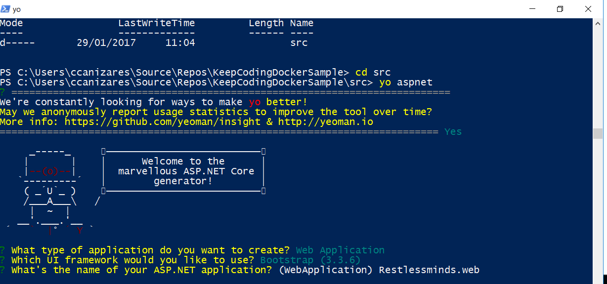
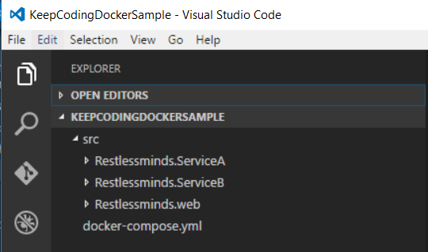
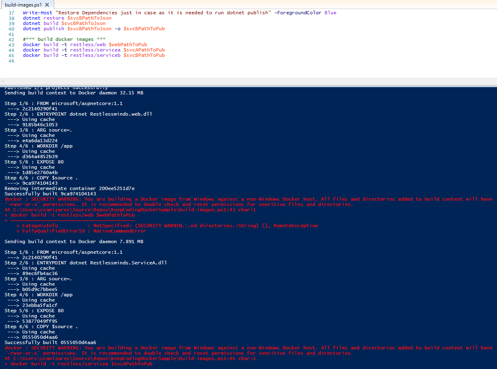
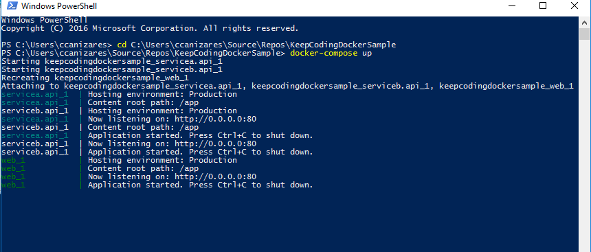
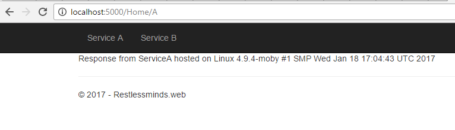
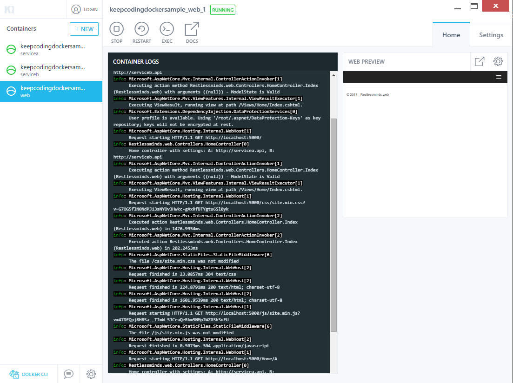

En un <a href='https://ccanizares.github.io/KeepCoding/notes/devops-infrastrucura-como-codigo' title='ccanizares keepcoding DevOps Infrastructura cómo código'> post anterior</a> entre historias viejunas explicaba un poco la evolución de los desarrolladores de software desde mi perspectiva y la importancia que tiene ser ágil a la hora de levantar entornos y deployar software en estos. 

En este post me propongo explicar <u>como crearnos un entorno de desarrollo</u> con <b>docker</b> y <b>asp.net core</b> totalmente aislado de tu máquina. Docker permite definir infrastructura como código y fácilmente levantar contenedores para correr aplicaciones en un entornos aislados e independientes. Todo esto que hago en el post manualmente para deployar las aplicaciones a docker pensad que <u>se acabará haciendo automáticamente con Visual Studio 2017</u>, pero no está mal conocer un poco que está pasando por detrás de esa magia que nos proporcionará el ID. Por tanto el proposito del post es conocer <b>docker</b>, <b>docker-machine</b>, <b>docker-compose</b> y como usarlos en aplicaciones .net core para desplegar a tu entorno de development que será un docker host que tendremos instalado en nuestra máquina local.  

Simularé una aplicación web (asp.net mvc) que consume dos microservicios A y B (asp.net api). 

### ¿Qué es docker?

Sin ánimo de ofender a nadie de IT, mi definición de docker enfocada a desarrolladores es que es un sistema de virtualización más rápido y ligero que el típico al cual estábamos acostumbrados y que tiene tools y demás que facilitan bastante la creación de la infraestructura donde correrá nuestro software. Por tanto <u>podemos definir la infrastructura donde correrá una aplicación en un fichero</u> que incluimos junto al resto de código de nuestro proyecto, lo que implica que podremos versionarlo, configurar environments, características de las imágenes, etc.. <b>Docker</b> también está disponible para windows lo cual permite usar este sistema desde un so windows, desplegar en contenedores en tu sistema docker local y <u>fácilmente trasladar los contenedores a un docker remoto</u> (producción o integración…). Esto no quita que en determinados escenarios necesites a gente con conocimientos sólidos de IT para configurar bien clusters, orquestración y escalado bajo demanda… esto ya no es tan sencillo. 

Como comentaba en el ejemplo estoy trabajando con <b>contenedores</b> Linux pero recientemente docker ha añadido soporte para contenedores Windows en su última versión (no lo he probado todavía a día de hoy). 
 
### ¿Qué es Asp.Net Core?

Una de las novedades más esperadas y que empieza a ser una realidad palpable es que .Net core es un framework que puede correr también en entornos Linux.

### Microservicios

Mi definición casera es que pasas a tener N <u>back-ends cada uno independiente capaz de correr por sí solo</u>. Optar por este tipo de aplicaciones en sustitución de una aplicación monolítica puede ofrecer ventajas, tienes una aplicación modular en la que puedes distribuir un evolutivo parcialmente sin tener que desplegar toda tu aplicación. Otra ventaja es el ahorro de costes a la hora de escalar. Imagina que tienes un portal de venta online, este ofrece un catalogo de productos en la página principal cuyo directorio de productos puede ser consultado 
sin tener que estar registrado en el portal. Se nos da el caso que tenemos un número elevado de peticiones en las páginas libres de registro pero apenas un 2% se registran y completan el proceso de purchase de productos. Seguramente queramos que la experiencia de usuario sea buena al consultar productos, por tanto escalaremos infraestructura si es necesario para que la respuesta y rendimiento del portal sea adecuado... el coste en máquina subirá... si nuestra aplicación es monolítica no podremos decidir si ampliamos máquina para todo el portal o sólo para la parte que recibe más visitas. Otro ejemplo a favor de microservicios, es que <u>puedes desplegar partes de tu aplicación sin necesidad de desplegar todo el paquete completo</u>. Claro, esto añade cierta complejidad al proceso de integración y despliegue de nuestra aplicación de ahí que se diga que los microsservicios surgen un poco de la explosión del fenomeno <b>devops</b>.  

### Aplicación web .net core + servicios paso a paso

A continuación te proporciono los pasos necesarios para desplegar en un tu docker-host local, la idea es tener un contenedor para cada aplicación web.  

>En el momento que estoy escribiendo este post está saliendo la RC3 de Visual Studio 2017. Este IDE incorpora tools y "magia" para realizar todo este trabajo que haremos en este post manualmente por ti, pero de momento no queremos "magia" sino entender lo básico de docker y como hacer para correr asp.net core en contenedores. Ya escribiré más adelante sobre como usar docker con Visual Studio 2017 o si no podéis esperar al post siempre podéis ir a este enlace del pasado Connect en channel 9 y ver <a href='https://channel9.msdn.com/Events/Connect/2016/172'>esta demo de Glenn Condron</a>.

#### Ingredientes

Un IDE para trabajar con .net core, te recomiendo <a href='https://code.visualstudio.com/'>VSCode</a> en este ejemplo ya que haremos todo el proceso de deploy manualmente con comandos. 
Si lo haces necesitarás tener <a href='https://docs.microsoft.com/en-us/aspnet/core/client-side/yeoman' title='asp.net core y yeoman'>yeoman</a> que te proporcionará la template básica de proyecto [^1]. 




<a href='https://www.microsoft.com/net/download/core#/current'>Asp.net core 1.1</a> [^2]
<br>
<a href='https://docs.docker.com/docker-for-windows/'>Docker for Windows</a>


#### Overview

La 'arquitectura' está compuesta por 3 aplicaciones web asp.net core, cada una correrá en su propio <b>contenedor docker</b> (instancia independiente). 
La web, en la home tendrá dos links uno al servicio A y otro llamará al servicio B. Tanto servicio A como servicio B son apis en las que en el ValuesController que proporciona la plantilla por defecto está devolviendo un string con información sobre el host donde corre la api. 

##### Crear manualmente ficheros docker file y docker compose
Si has usado Yeoman como recomendaba, verás que la template de aspnet ya incorpora el fichero dockerfile por tanto sólo tendrías que editarlo con la información que indico en el apartado dockerfile de este post. 
El fichero que sí necesitarás crear manualmente será docker-compose.yml en la root. 

``` java
Restlessminds.Web
|
|___src_________
|		|__Restlessminds.Web
|               |     |_dockerfile
|               |     |_...
|               |
|               |
|	        |__Restlessminds.ServiceA
|               |     |_dockerfile
|               |     |_...
|		|
|		|__Restlessminds.ServiceB
|                     |_dockerfile
|                     |_...
|
|
|__docker-compose.yml
|__ ...
```

##### Web

Este es el código que uso en el controlador principal de la web, es importante fijarse en que accedo a cada 'microservicio' con una llamada http y que la dirección de donde está alojada cada servicio me viene de la configuración de settings.

``` java
public class HomeController : Controller
{
    private readonly IOptions<AppSettings> _settings;
    private readonly ILogger _logger;

    public HomeController(IOptions<AppSettings> settings, ILogger<HomeController> logger)
    {
        _settings = settings;
        _logger = logger;

        if (logger.IsEnabled(LogLevel.Debug))
            logger.LogInformation($"Home controller with settings: A: {settings.Value.ServiceAUrl}, B: {settings.Value.ServiceBUrl}");
    }

    public IActionResult Index()
    {
        return View();
    }

    public async Task<IActionResult> A()
    {
        var client = new HttpClient();

        var serviceAUrl = $"{_settings.Value.ServiceAUrl}/api/values";
        var dataString = await client.GetStringAsync(serviceAUrl);
        ViewBag.Data = dataString;

        return View();
    }

    public async Task<IActionResult> B()
    {
        var client = new HttpClient();

        var serviceBUrl = $"{_settings.Value.ServiceBUrl}/api/values"; 
        var dataString = await client.GetStringAsync(serviceBUrl);
        ViewBag.Data = dataString;

        return View();
    }
}
```

###### Settings

Como decía la web tiene definida la dirección http a cada servicio en el fichero appsettings.json de la aplicación. 

``` java
{
  "ServiceAUrl": "http://localhost:34927",
  "ServiceBUrl": "http://localhost:35024"
}
```

Es importante entender que en el proceso de deploy con <b>docker-compose</b> se pisarán los valores que definamos aquí con los valores que posteriormente definiremos en docker-compose.yml. Para que esto sea posible hemos de decirle a nuestra aplicación web que añada a la configuración variables de entorno de este modo:

``` java
public Startup(IHostingEnvironment env)
{
    var builder = new ConfigurationBuilder()
        .SetBasePath(env.ContentRootPath)
        .AddJsonFile("appsettings.json", optional: true, reloadOnChange: true)
        .AddEnvironmentVariables();
  ...
}
```

##### Servicios

Ambos servicios varian muy poco su implementación. En ValuesController he dejado la acción GET y la implementación es la siguiente variando únicamente el literal con el nombre de servicio. 

``` java
// GET api/values
[HttpGet]
public string Get()
{
    return $"Response from ServiceA hosted on {RuntimeInformation.OSDescription}";
}
```

#### Dockerfile, docker hub e imagenes

##### ¿Qué es dockerfile? 

Es un fichero que contiene la información para construir la imagen. Como decíamos en la sección anterior cada aplicación web correrá en un contenedor diferente, es importante entender que <u>un contenedor se crea a partir de una imagen</u>. 

Ejemplo de un docker file para una aplicación asp.net: 

``` powershell
FROM microsoft/aspnetcore:1.1
ENTRYPOINT ["dotnet", "myaspnetcoreapplication.dll"]
ARG source=.
WORKDIR /app
EXPOSE 80
COPY $source .
```

##### ¿Qué es docker hub? 

Es un repositorio de imagenes, por defecto docker tiene un servicio hub online oficial donde los fabricantes suben imágenes públicas. No es necesario darte de alta para obtener las imagenes públicas (por ejemplo necesitaremos la base con el tooling de .net core). Tu propio docker-host tambien tiene un repositorio local de imagenes al que necesitaremos añadir una imagen por cada aplicación que posteriormente queremos que corra en contenedores.

>Para esta demostración no necesitamos un servicio hub online. Este tipo de servicio podría sernos útil si queremos crear imagenes base de aplicaciones para nuestro equipo en un entorno corporativo en las que ya partan de un escenario seed base... En este caso podríamos registrar imagenes privadas y dar acceso a los miembros del equipo. Si quieres más info podrías informate sobre <a href='https://hub.docker.com/'>Docker Hub</a> o <a href='https://azure.microsoft.com/en-us/services/container-registry/'>Azure Container Registry (preview)</a>. 

##### ¿Como creo las imágenes para mis aplicaciones?

Para construir una imagen lo haremos a partir del comando <b>docker buid</b>. A este le pasamos como parámetro la ruta al fichero <b>docker file</b> donde hemos definido la información de la imagen asociada a nuestra aplicación <b>.net core</b>. 

Antes de construir la imagen necesitaremos publicar nuestra aplicación .net core a un directorio por medio del comando dotnet publish. Por tanto, para construir cada imagen tendremos que replicar estos pasos. 

``` javascript
dotnet restore {PATH_TO_JSON}
dotnet build {PATH_TO_JSON}
dotnet publish {PATH_TO_JSON} -o {DESTINATION_PATH_TO_DLL}
docker build {DESTINATION_PATH_TO_DLL}
```

Al comando <b>docker build</b> le estamos pasando la ruta donde hemos publicado las dll de nuestra aplicación mediante el comando <b>dotnet publish</b>. En este punto hemos de entender que nuestra aplicación web contiene un fichero docker file que tenemos que asegurarnos que se esté copiando al mismo directorio donde generamos la dll.

>Es importante entender que sólo necesitaremos replicar estos pasos si nuestra aplicación ha sufrido cambios desde el último deploy, es decir, si ha cambiado el código necesitaremos volver a generar la dll y registrar de nuevo la imagen.

#### Docker-compose.yml

<b>Docker compose</b> es una tool que hemos instalado con el paquete de docker tools for windows y <u>permite definir y lanzar aplicaciones multicontenedor con docker</u>. En el ejemplo que estamos mostrando aquí tenemos un único fichero docker-compose.yml en la root de nuestra solución pero podríamos tener uno por entorno si fuese el caso. 


Ejemplo docker-compose-yml: [^3]


``` powershell
version: '2'

services:
  web:
    image: restless/web
    environment:
      - serviceAUrl=http://serviceA.api
      - serviceBUrl=http://serviceB.api
    ports:
      - "5000:80"
    depends_on:
      - serviceA.api
      - serviceB.api

  serviceA.api:
    image: restless/servicea
    expose:
      - "80"
    ports:
      - "5001:80"

  serviceB.api:
    image: restless/serviceb
    expose:
      - "80"
    ports:
      - "5002:80"
```

El fichero es bastante intuitivo en si, este fichero contiene un bloque por contenedor que queremos desplegar. En cada bloque hacemos referencia en sí a la imagen a partir de la cual se generará el contenedor. En el contenedor web tenemos dos settings en el apartado environment cuyo valor sustituirá a las entradas que habíamos definido con el mismo nombre en el fichero appsettings.json en la aplicación web.  

### Ready? Go! Despliegue a docker host. 


Una vez hemos vertido los ingredientes y hemos realizado todos los preparativos esto debería funcionar. Para desplegar nuestra aplicación tendremos que realizar los siguientes pasos manualmente (los puedes automatizar en un .ps1 o .sh):

1) Como explicaba más arriba tendrás que realizar los pasos <b>dotnet restore</b>, <b>dotnet build</b>, <b>dotnet publish</b>, <b>docker build</b> para cada proyecto (en la captura docker-build muestra un warning pero crea correctamente las imagenes aunque veas el texto en rojo).<br><br>


2) Situarte por linea de comando a la altura del fichero docker-compose.yml y lanzar el comando <b>docker-compose up</b>.
<br><br>


Como veis al desplegar a docker-host Environment.OSVersion nos dice que estamos corriendo los servicios en Linux con lo cual ya vemos que hemos hecho bien el deploy a nuestro entorno de Dev con docker.
<br><br>


### Comandos útiles docker

docker ps -> Te lista los contenedores activos. 

```
PS C:\Users\ccanizares\Source\Repos\KeepCodingDockerSample> docker ps
CONTAINER ID        IMAGE               COMMAND                  CREATED             STATUS              PORTS                  NAMES
d0acced27517        restless/web        "dotnet Restlessmi..."   10 minutes ago      Up 10 minutes       0.0.0.0:5000->80/tcp   keepcodingdockersample_web_1
e3042a15e5b7        restless/servicea   "dotnet Restlessmi..."   2 days ago          Up 10 minutes       0.0.0.0:5001->80/tcp   keepcodingdockersample_servicea.api_1
5b3fcfee656e        restless/serviceb   "dotnet Restlessmi..."   2 days ago          Up 10 minutes       0.0.0.0:5002->80/tcp   keepcodingdockersample_serviceb.api_1
```

docker attach {container} -> Te conectas a un contenedor y ves el log por consola. <br>
docker rm {container -> para eliminar un contenedor}<br>
docker images -> Te muestra las imagenes disponibles en tu docker local.

```
PS C:\Users\ccanizares\Source\Repos\KeepCodingDockerSample> docker images
REPOSITORY             TAG                 IMAGE ID            CREATED             SIZE
restless/web           latest              9ca974104143        22 minutes ago      300 MB
<none>                 <none>              ed1af7d5cbd4        2 days ago          300 MB
restless/serviceb      latest              16db32918373        2 days ago          276 MB
restless/servicea      latest              0555050d4aa6        2 days ago          276 MB
<none>                 <none>              7fe70594a146        2 days ago          300 MB
<none>                 <none>              6eb771c512df        2 days ago          276 MB
<none>                 <none>              524efaf9642d        2 days ago          300 MB
<none>                 <none>              e7decc07a7c6        2 days ago          276 MB
<none>                 <none>              265146c5c3c7        2 days ago          276 MB
<none>                 <none>              7d569c174025        2 days ago          300 MB
microsoft/aspnetcore   1.1                 2c2140290f41        3 days ago          268 MB
```

... Mejor mira la <a href='https://docs.docker.com/engine/reference/commandline/docker/'>página de docker</a> o el siguiente párrafo XD ...

### Tools útiles docker

Con las tools de docker para windows viene Kitematic que te podría evitar tirar bastantes comandos, en forma de aplicación visual podrás acceder y manipular la información de docker host. Contenedores activos, su configuración, imágenes, etc..
<br><br>

<br><br>
Y hasta aquí el post de hoy. Remarcar que el <u>objetivo de este post es conocer un poco como puede ayudarnos docker a los desarrolladores</u>. En esta serie de correos estoy hablando de <b>devops</b> y de diferentes conceptos y herramientas, aprovechando que hemos hablado de docker en este post os recomiendo leer <a href='http://www.modestosanjuan.com/desarrollador-pon-contenedores-en-tu-vida/'>este post</a> que me gustó bastante, bastante práctico si eres dev y tocas muchos palos para no tener que formatear tu pc cada 2 meses. 

[^1]: En la imagen muestro como crear el proyecto web a partir de la plantilla de yeoman, repetiré el proceso para los dos servicios que serán dos proyectos asp.net web api. Al crear la aplicación con yeoman puedes elegir entre diferentes tipos de plantilla. Usa la de web api para los servicios y la de web para la web.
[^2]: Yeoman no me ha generado un proyecto tipo csproj pero puedes trabajar con la versión 1.1 y project.json con un matiz.</a>
[^3]: La versión que tengo instalada de docker-compose en estos momentos permite trabajar con versión '3' de ficheros, <a href='https://www.youtube.com/watch?v=y_RiG_9jEJ0'>más info</a>. 


