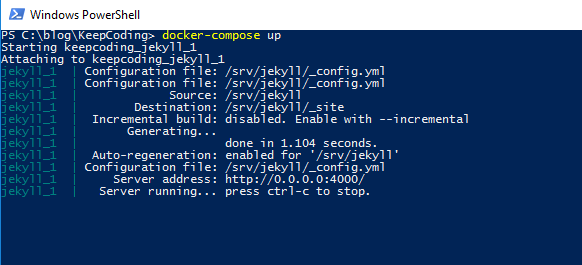

Si te dispones a usar <b>jekyll</b> en un Pc <b>windows</b> <b>docker</b> puede serte de bastante utilidad. En los últimos meses me ha tocado reinstalar todo mi entorno de trabajo dos o tres veces y tengo que decir que usando Windows y trabajando con .net y relacionados a día de hoy no es demasiado costoso. Lo que me cuesta es poner en marca el blog que necesita <b>jekyll</b> y para instalarlo en <b>Windows</b> acabas instalándote <b>chocolatey</b>, <b>ruby</b>, etc... y casi siempre he tenido algún problema y acabo dedicando tiempo a buscar info porque no conozco demasiado ruby. 
<br ><br >
Esta mañana cuando me disponía a instalar jekyll me ha dado por mirar si había disponible alguna imagen para <b>docker</b> y efectivamente.
<br ><br >
<i>A continuación explico los pasos que he seguido para poner en marcha mi entorno de dev</i>.
<br ><br >
-Necesitas <a href='https://docs.docker.com/docker-for-windows/'>Docker for Windows</a> <br >
-La web que quieres que corra en <b>jekyll</b> en un directorio local de tu Pc.  <br >
-Una vez instalado docker, ves a Settings/Shared Drives y comparte la unidad donde tengas la web.<br >
-Crea un archivo <b>docker-compose.yml</b> en la root de la web con el siguiente contenido:<br >

``` powershell
version: "3"

services:

  jekyll:
    image: jekyll/jekyll:pages
    command: jekyll serve --watch
    ports:
      - 4000:4000
    volumes:
      - .:/srv/jekyll
```

Una vez lo tienes, con powershell lanzas el comando <b>docker-compose up</b>. 



Ya puedes navegar a la web en el puerto 4000.


