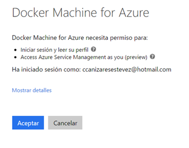
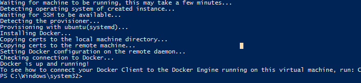
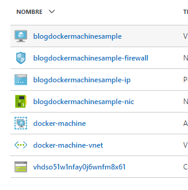
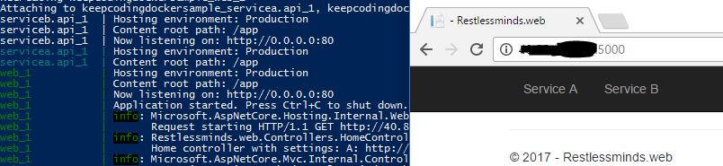

En el <a href='#'>post anterior</a>, con la instrucción docker-compose levantamos los contenedores en nuestro docker host que tenemos corriendo en Windows. Al instalar docker en un SO windows, este corre en un servicio (Docker for windows Service) y una máquina virtual en hyper V. 
Hoy veremos como crear una máquina virtual (Linux) en Azure y desplegar exactamente la <a href=''>misma aplicación del post anterior</a> y veréis que es bastante sencillo. 
#### Crear la máquina en Azure
>Docker-machine indicando -d azure creará por ti un resource group (por defecto lo llama docker-machine), máquina virtual (ubuntu) y lo necesario para la máquina (red, etc..)

Abrimos powershell, el siguiente comando indicando nombre de host y id de suscripción.
``` powershell
docker-machine create -d azure --azure-ssh-user ops --azure-subscription-id a6yq8iw-xxx-4dbb-aaaa-000000011111 --azure-open-port 80 nombredeldockerhost
```
Seguidamente, tendrás que autenticarte... la consola te mostrará una url que has de pegar en el navegador y introducir el código que también te indica la consola... A partir de ahí introduces tus credenciales, aceptas y ya puedes volver a la consola. 
<br>
<br>

<br>

Una vez finaliza el proceso, escribimos 'docker-machine env nombredelhost' y nos responderá con un comando que copiamos y ejecutamos. Mientras no cerremos la consola estaremos conectados a la máquina de azure. 

>A lo largo de este proceso con los comandos asociados a docker-machine env hemos descargado una serie de certificados que permiten establecer una conexión segura ssh entre la máquina remota y mi dispositivo con docker-machine. Si cerramos la consola, tendremos que volver a conectar docker a la instancia remota, lanzando el comando <b>docker-machine env nombredelhostremoto</b>. Si no recuerdas el nombre del host o tienes varios podrías usar el comando <b>docker-machine ls</b>

#### Build y compose

Para desplegar la aplicación tendremos que ir al directorio raiz, ejecutar el script ps1 para construir las imagenes y una vez finalizado ya podemos generar los contenedores en el host de azure con 'docker-compose up' igual que lo haríamos si estuviesemos generándolos en windows. Esta build será un poco más lenta dependiendo de tu conexión a internet porque los contenedores se envian a Azure en vez de a tu host local. 
<br> 
Por último para acceder a la web tendrías que abrir un puerto en el firewall de la red que se ha creado en el resource group de Azure que apunte al puerto 5000 que es donde tenemos escuchando la web. Vamos al portal de Azure, veremos que se ha creado un nuevo resource group docker-machine en nuestra suscripción. <br>
 
<br>
Vamos al firewall y abrimos una regla que deje pasar el tráfico para el rango de puertos 5000-5002. Ahora ya que estamos en el portal podemos consultar allí la ip remota de la máquina. Si no queremos acceder al portal si estamos apuntando docker-machine a remoto, podríamos saber la ip del host remoto con el comando <b>docker-machine ip nombredelhostremoto</b>.
<br>
Ya estaría si navegamos a http://iphost:5000/ deberíamos poder acceder a nuestra web ya hospedada en Azure. 
<br>

