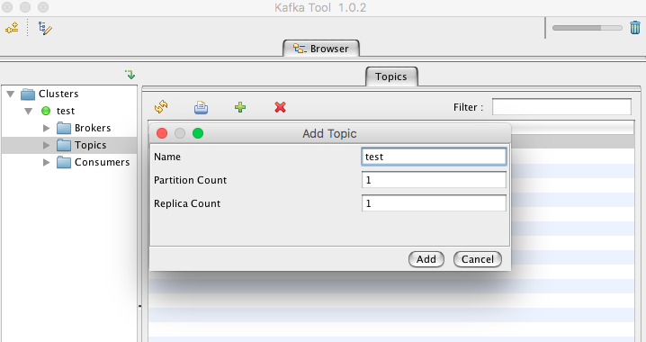

In this post I'm sharing some instructions to set up a playground to test a little bit with kafka topics from a node application. 

First of all when I’m doing pocs I always think on docker to avoid polluting my labtop with services I will use sporadically. Effectively kafka is supported by docker community, I’m using <a href='https://hub.docker.com/r/spotify/kafka/'>this image</a> if you <a href=''>clone my repository</a> and run docker-compose up should work in your docker-host.

Once you have kafka and zookeeper running you can focus on javascript client. Looking a little bit on github community have already implemented I found <a href='https://www.npmjs.com/package/kafka-node'>this repo</a> that looks pretty cool. In order to set up a web application with node I will use express. The goal of this poc is test the kafka client, play a little bit and have a boilerplate for testing more advanced scenarios in future.

<h4>Implemented pocs</h4>

1 -	Getting a list of topics avaible in a cluster. 

2 -	Send a message into a topic. 

3 -	Subscribe a topic and log in console the body of a message each time it’s received. 

<h4>Instructions to set up the playground</h4>

1 -	Clone this repo. (need git)

2 -	Open docker-compose.yml on the root, set your ip in ADVERTISED_HOST env var. 

3 -	Run docker-compose up (need docker)

4 -	Run node index.js (need node)

At this point I recommend to install in your machine any client tool, I’ve used <a href='http://www.kafkatool.com/download.html' >Kakfa tool for Mac</a> (cannot find any working quick alternative to manage kafka from a dockerized app). 
Within this application you can ensure that the cluster is up, you can connect and also use this application to create a topic. 

Once you have created a topic, you can open a browser and navigate to http://localhost:3000'. 

First screen let you enter a different connection string if you want to connect to a different kafka cluster than the docker-host one  we have created. (Not tested against a ‘remote’ cluster yet). If you don’t enter any connection string the application will connect default to local kafka.. 

Ok, let’s start to check if everything works.. Click on topics, you should see listed the topic you have already created in the previous step. 

If we subscribe to this topic and take a look to the console we can see how messages are recibed (manually generated from kafka tool).

### Conclusion 

node-kafka pakage I'm using in this poc works and it's documentation rules. On the other side we have a docker compose file that we can use for other pocs or simulations.

